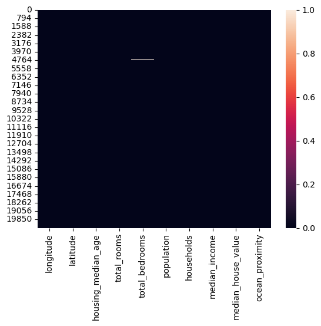
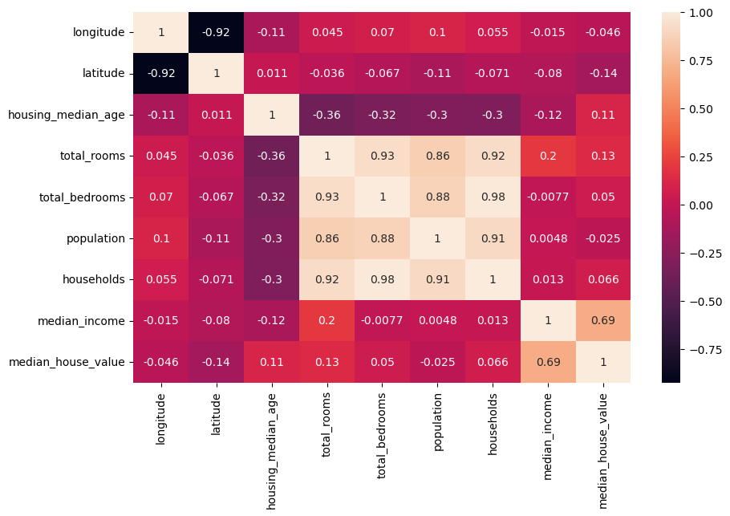
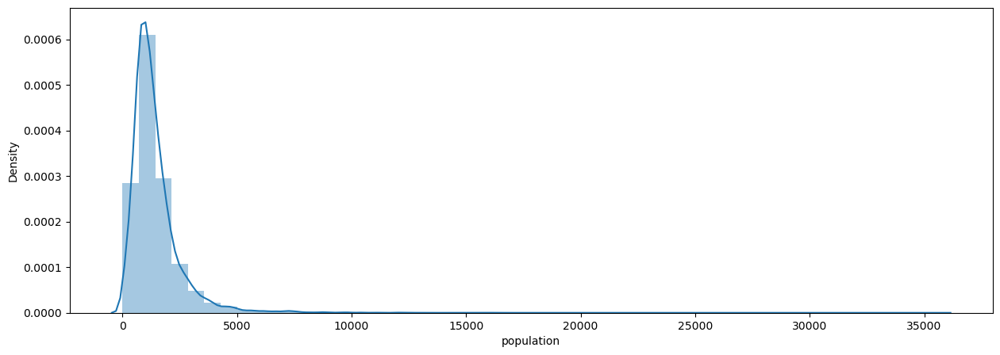
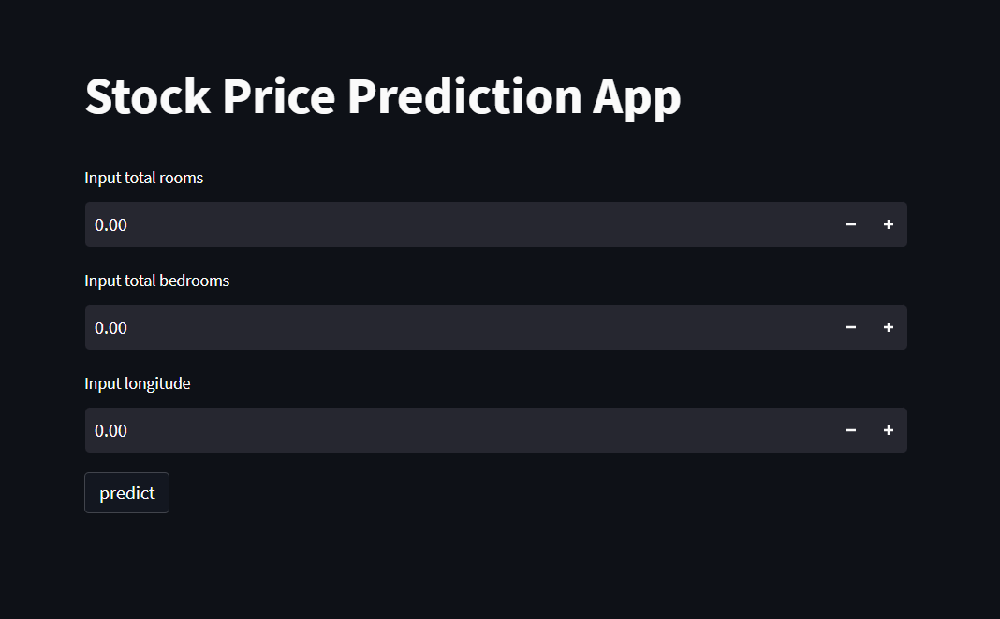

# Laporan Proyek Machine Learning
### Nama : M.Fadhil Alghifari
### Nim : 211351078
### Kelas : Malam A

## Domain Proyek

Proyek ini bertujuan untuk menganalisis dan memprediksi harga perumahan di California. Harga perumahan adalah faktor kunci dalam industri properti, dan pemahaman mendalam tentang faktor-faktor yang memengaruhi harga perumahan di wilayah tertentu sangat penting untuk berbagai kepentingan, seperti pembeli rumah, penjual, dan investor properti. Analisis ini akan membantu dalam mengidentifikasi tren harga perumahan di California, memahami variabel-variabel yang memengaruhi harga, dan membuat prediksi harga perumahan di masa depan. Data yang digunakan dalam proyek ini mencakup berbagai fitur seperti jumlah kamar tidur, luas tanah, tingkat kepadatan penduduk, pendapatan rata-rata per rumah tangga, dan lokasi geografis. Dengan informasi ini, proyek ini akan menggali wawasan tentang pasar perumahan di California, yang dapat bermanfaat bagi berbagai pemangku kepentingan.

## Business Understanding

Proyek ini bertujuan untuk memberikan pemahaman mendalam tentang harga perumahan di California. Harga perumahan adalah elemen sentral dalam pasar properti, dan pemahaman yang kuat tentang dinamika pasar ini sangat penting untuk berbagai pemangku kepentingan, termasuk calon pembeli, penjual, pengembang, dan investor properti. Analisis ini akan membantu dalam mengidentifikasi faktor-faktor yang memengaruhi harga perumahan di California dan memungkinkan pihak-pihak yang terlibat untuk membuat keputusan yang lebih baik.

### Problem Statements

Dalam menghadapi dinamika pasar perumahan yang kompleks dan beragam di California, berbagai pemangku kepentingan, termasuk calon pembeli, penjual, pengembang, dan investor, menghadapi sejumlah tantangan yang perlu diatasi:

1. Penentuan Harga yang Optimal: Bagaimana menentukan harga perumahan yang optimal di berbagai wilayah California, mempertimbangkan sejumlah faktor seperti jumlah kamar tidur, luas tanah, lokasi geografis, dan faktor sosial ekonomi lainnya

2. Prediksi Harga Perumahan di Masa Depan: Bagaimana memprediksi harga perumahan di masa depan berdasarkan tren historis dan variabel-variabel yang relevan. Prediksi ini akan membantu calon pembeli dan penjual merencanakan transaksi mereka.

### Goals

Tujuan utama proyek ini adalah memberikan wawasan yang mendalam dan solusi untuk pemangku kepentingan dalam mengatasi tantangan pasar perumahan di California:

1. Prediksi Harga Perumahan yang Akurat: Membangun model prediksi harga perumahan yang akurat berdasarkan data historis dan variabel-variabel yang relevan, sehingga calon pembeli dan penjual dapat menentukan harga perumahan dengan lebih bijak.

2. Pemetaan Geografis yang Akurat: Melalui analisis geografis, memahami distribusi harga perumahan di berbagai wilayah California untuk mendukung keputusan terkait lokasi pembangunan dan investasi properti.

### Solution statements

Solusi untuk tantangan yang dihadapi dalam analisis harga perumahan di California adalah sebagai berikut:

1. Pengembangan Model Prediksi: Membangun model prediksi harga perumahan yang dapat memberikan estimasi harga yang akurat berdasarkan fitur-fitur yang relevan, seperti jumlah kamar tidur, luas tanah, lokasi geografis, dan variabel-variabel lainnya.

2. Visualisasi dan Pemahaman Lokasi: Menghasilkan visualisasi dan pemahaman tentang distribusi harga perumahan di seluruh wilayah California untuk membantu pemangku kepentingan dalam memahami tren geografis.

3. Rekomendasi Harga: Memberikan rekomendasi harga yang lebih baik untuk calon pembeli dan penjual perumahan, serta menyusun panduan untuk strategi penawaran yang lebih baik.

## Data Understanding

Dari pengumpulan data yang telah diambil dari kaggle mengenai prediksi harga rumah di California.

(https://www.kaggle.com/code/subashdump/california-housing-price-prediction)

### Variabel-variabel pada California Housing Price Prediction Dataset adalah sebagai berikut:

0   longitude           =  float
 1   latitude            =  float
 2   housing_median_age  =  float
 3   total_rooms         =  float
 4   total_bedrooms      =  float
 5   population          =  float
 6   households          =  float
 7   median_income       =  float
 8   median_house_value  =  float
 9   ocean_proximity     =  object 

## Data Preparation

## Data Collection

Data ini saya dapatkan dari kaggle tetang California Housing Price Prediction Dataset

## Data Discovery And Profiling

#### - Mengimport library yang di butuhkan

``` bash
import pandas as pd
import numpy as np
import seaborn as sns
import matplotlib.pyplot as plt
from sklearn.linear_model import LinearRegression
from sklearn.model_selection import train_test_split
```

#### - Memanggil Dataset yang digunakan

``` bash
df = pd.read_csv('housing.csv')
```

#### - Melihat 5 data yang dipanggil

``` bash
df.head()
```

#### - Selanjutnya melihat info dari data 
``` bash
df.info()
```

#### - Mencari Heatmap

Kode program `sns.heatmap(df.isnull())` digunakan untuk membuat sebuah heatmap (peta panas) yang menggambarkan lokasi dan sebaran data yang hilang (missing data) dalam sebuah DataFrame `df` menggunakan library Python seaborn (biasanya disingkat sebagai `sns`).

Penjelasan komponen-komponen utama dari kode tersebut adalah sebagai berikut:

1. `sns`: Ini adalah singkatan dari Seaborn, yang merupakan library Python yang sering digunakan untuk membuat visualisasi data yang lebih menarik dan informatif.

2. `.heatmap()`: Ini adalah metode dalam Seaborn yang digunakan untuk membuat visualisasi peta panas. Metode ini menerima input berupa matriks data, dan akan menghasilkan tampilan warna yang memperlihatkan nilai-nilai dalam matriks tersebut.

3. `df.isnull()`: Ini adalah ekspresi yang digunakan untuk mengidentifikasi data yang hilang (missing data) dalam DataFrame `df`. Ketika dipanggil pada DataFrame, metode `.isnull()` mengembalikan DataFrame yang memiliki nilai `True` di tempat di mana data hilang, dan `False` di tempat di mana data tersedia.

``` bash
sns.heatmap(df.isnull(), cmap="viridis")

plt.show()
```
 <br>

#### - Disini kita akan melihat nilai data

``` bash
df.describe()
```

#### - Ini adalah bagian visualisasi data 
1. plt.figure(figsize=(10,6)): Ini adalah baris pertama dalam kode. Ini digunakan untuk membuat sebuah gambar atau figur dengan ukuran yang ditentukan. Dalam kasus ini, gambar akan memiliki lebar 10 inci dan tinggi 6 inci, sesuai dengan parameter (10, 6) yang diberikan. Ukuran gambar ini berguna untuk mengendalikan seberapa besar atau kecil gambar heatmap akan muncul saat dihasilkan.

2. sns.heatmap(df.corr(), annot=True): Baris ini digunakan untuk membuat heatmap dari korelasi antar variabel dalam DataFrame df dengan menggunakan library Seaborn (sns adalah alias untuk Seaborn). Ini terdiri dari dua bagian utama:

- df.corr(): Ini adalah panggilan fungsi corr() pada DataFrame df, yang menghitung matriks korelasi antar variabel dalam dataset. Matriks korelasi adalah sebuah matriks yang menunjukkan sejauh mana dua variabel berhubungan satu sama lain. Nilai korelasi berkisar antara -1 (korelasi negatif sempurna) hingga 1 (korelasi positif sempurna). Nilai 0 menunjukkan tidak adanya korelasi. Hasil dari df.corr() adalah matriks korelasi ini.

- annot=True: Parameter ini digunakan untuk menambahkan angka-angka ke dalam sel-sel heatmap. Angka-angka ini adalah nilai korelasi antar variabel yang ditunjukkan oleh warna di heatmap. Jika annot diatur sebagai True, maka angka-angka tersebut akan ditampilkan di setiap sel heatmap.

``` bash
plt.figure(figsize=(10,6))
sns.heatmap(df.corr(), annot=True)
```
 <br>

- Code program `df.isnull().sum()` digunakan untuk menghitung jumlah nilai-nilai yang hilang (NaN/null) dalam sebuah DataFrame (biasanya dinotasikan sebagai `df`), dan mengembalikan hasil dalam bentuk sebuah Series yang menunjukkan jumlah nilai-nilai yang hilang untuk setiap kolom dalam DataFrame.

Ini adalah beberapa penjelasan untuk setiap bagian dari kode program tersebut:

1. `df`: Ini adalah DataFrame yang akan dianalisis. Sebuah DataFrame adalah struktur data dalam bahasa pemrograman Python yang sering digunakan untuk menyimpan dan mengelola data dalam bentuk tabel, seperti spreadsheet. Dalam hal ini, `df` adalah nama yang digunakan untuk merujuk pada DataFrame tersebut.

2. `.isnull()`: Ini adalah metode yang digunakan pada DataFrame yang akan mengembalikan DataFrame baru dengan nilai-nilai boolean (True/False) yang menunjukkan apakah setiap elemen dalam DataFrame adalah null (NaN) atau tidak. Hasil dari `.isnull()` adalah DataFrame baru yang memiliki bentuk yang sama dengan `df`, tetapi berisi True jika elemen adalah null dan False jika tidak.

3. `.sum()`: Ini adalah metode lain yang digunakan pada DataFrame, dan dalam konteks ini, ia menghitung jumlah True dalam setiap kolom DataFrame yang dihasilkan oleh `.isnull()`. Ini mengembalikan hasil dalam bentuk Series yang menunjukkan jumlah nilai-nilai yang hilang (True) dalam setiap kolom DataFrame.

``` bash
df.isnull().sum()
```

``` bash
plt.figure(figsize=(15,5))
sns.distplot(df['population'])
```
 <br>

#### - Modeling Data

Kode program di bawah ini terlihat seperti mengambil dua kolom dari suatu DataFrame (df) sebagai input fitur (x) dan satu kolom sebagai target (y):

- Pada baris pertama, `x` adalah variabel yang akan menyimpan fitur-fitur dari dataset. Dua kolom yang diambil dari DataFrame adalah 'housing_median_age' dan 'ocean_proximity'. Biasanya, dalam pemrosesan data, kita memilih kolom-kolom tertentu yang dianggap relevan atau penting untuk analisis atau pemodelan. Kolom 'housing_median_age' berisi data tentang usia median perumahan, dan 'ocean_proximity' berisi informasi tentang kedekatan properti dengan garis pantai atau perairan (mungkin dalam bentuk kategori seperti "NEAR BAY", "INLAND", dll.). Ini adalah fitur-fitur yang akan digunakan dalam analisis atau pemodelan lebih lanjut.

- Pada baris kedua, `y` adalah variabel yang akan menyimpan target dari dataset. Dalam hal ini, kolom 'latitude' dipilih sebagai target. Ini mungkin berarti bahwa tujuan dari analisis atau pemodelan ini adalah untuk memprediksi atau menggambarkan informasi yang terkait dengan data latitude berdasarkan fitur-fitur yang ada dalam `x`. Latitude adalah koordinat geografis yang mengacu pada lokasi geografis suatu properti, dan kemungkinan besar digunakan sebagai variabel target dalam analisis spasial atau pemodelan geografis.

Selanjutnya, Anda dapat menggunakan `x` dan `y` ini untuk melakukan berbagai analisis data atau membangun model statistik atau machine learning, tergantung pada tujuan dan konteks dari proyek atau analisis yang sedang dilakukan.
``` bash
x = df[['housing_median_age', 'ocean_proximity']] 
y = df['latitude']
```

#### - Split Data & Testing

Kode program di bawah menggunakan library `scikit-learn` (sklearn) untuk membagi dataset menjadi data pelatihan (training data) dan data pengujian (testing data). Biasanya, kita memiliki dataset yang terdiri dari dua komponen: fitur (features) yang disimpan dalam variabel `X` dan target atau label yang disimpan dalam variabel `y`. Tujuan utama dari kode ini adalah untuk memisahkan dataset ini menjadi dua bagian: satu untuk melatih model (X_train dan y_train) dan satu untuk menguji model (X_test dan y_test).

Di sini adalah penjelasan mengenai kode tersebut:

1. `from sklearn.model_selection import train_test_split`: Pada baris pertama kode, kita mengimpor fungsi `train_test_split` dari modul `model_selection` dalam library `scikit-learn`. Fungsi ini digunakan untuk membagi dataset menjadi dua subset: data pelatihan dan data pengujian.

2. `X_train, X_test, y_train, y_test = train_test_split(x, y, test_size=0.2)`: Pada baris kedua kode, kita menggunakan `train_test_split` untuk membagi dataset. Parameter yang digunakan adalah sebagai berikut:
- `x`: Ini adalah variabel yang berisi fitur atau atribut dari dataset.
- `y`: Ini adalah variabel yang berisi label atau target yang ingin diprediksi.
- `test_size`: Parameter ini menentukan seberapa besar bagian dataset yang akan digunakan untuk data pengujian. Dalam contoh di atas, `test_size=0.2` berarti bahwa 20% dari dataset akan digunakan sebagai data pengujian, sedangkan 80% sisanya akan digunakan sebagai data pelatihan.

Hasil dari pemanggilan `train_test_split` ini adalah empat variabel:
- `X_train`: Ini berisi subset dari fitur (X) yang akan digunakan sebagai data pelatihan.
- `X_test`: Ini berisi subset dari fitur (X) yang akan digunakan sebagai data pengujian.
- `y_train`: Ini berisi subset dari label (y) yang sesuai dengan data pelatihan.
- `y_test`: Ini berisi subset dari label (y) yang sesuai dengan data pengujian.

Dengan memisahkan dataset menjadi data pelatihan dan data pengujian, kita dapat melatih model pada data pelatihan dan menguji kinerja model tersebut pada data pengujian. Ini adalah praktik umum dalam pembuatan model machine learning untuk mengukur sejauh mana model tersebut mampu melakukan prediksi yang baik pada data yang belum pernah dilihat sebelumnya (data pengujian).

``` bash
from sklearn.model_selection import train_test_split
X_train, X_test, y_train, y_test = train_test_split(x, y, test_size=0.2)
```
#### - Seleksi Fitur

Kode program di bawah ini tampaknya berhubungan dengan pemilihan fitur (features) dari suatu dataset dan mengatur variabel untuk data input (x) dan target (y) dalam konteks analisis data atau pemodelan statistik/machine learning:

```python
fitur = ['total_rooms', 'housing_median_age', 'population']
```

Pada bagian ini, kita mendefinisikan sebuah daftar (list) bernama `fitur`. Daftar ini berisi nama-nama fitur atau variabel-variabel yang akan digunakan dalam analisis data atau pemodelan. Dalam hal ini, fitur yang akan digunakan adalah 'total_rooms', 'housing_median_age', dan 'population'. Ini berarti kita akan memfokuskan analisis pada tiga variabel tersebut.

```python
x = df[fitur]
```

Kode ini mengatur variabel `x` untuk menjadi subset dari dataframe `df` yang hanya berisi kolom-kolom yang sesuai dengan daftar fitur yang telah didefinisikan sebelumnya. Dengan kata lain, `x` akan berisi data input yang terdiri dari kolom 'total_rooms', 'housing_median_age', dan 'population' dari dataframe `df`.

```python
y = df['households']
```

Pada bagian ini, variabel `y` diatur untuk menjadi kolom 'households' dari dataframe `df`. Ini menunjukkan bahwa `y` adalah target atau variabel yang akan diprediksi atau dianalisis dalam konteks analisis data atau pemodelan yang sedang dilakukan.

Dengan demikian, keseluruhan kode ini bertujuan untuk memilih sejumlah fitur tertentu (dalam hal ini, 'total_rooms', 'housing_median_age', dan 'population') dari suatu dataframe (dalam hal ini, `df`) untuk digunakan sebagai data input (x) dan menentukan variabel target (y) yang akan digunakan dalam analisis data atau pemodelan yang sedang dilakukan.

``` bash
fitur = ['total_rooms','housing_median_age','population']
x = df[fitur]
y = df['households']
```

- Di bawah ini adalah penjelasan langkah-langkah yang dilakukan oleh kode di bawah:

1. **Import LinearRegression dari sklearn**:
   ```python
   from sklearn.linear_model import LinearRegression
   ```
   Kode ini mengimpor modul LinearRegression dari pustaka scikit-learn. Modul ini berisi implementasi model regresi linear yang akan digunakan dalam analisis.

2. **Inisialisasi objek LinearRegression**:
   ```python
   lr = LinearRegression()
   ```
   Baris ini membuat objek LinearRegression yang disimpan dalam variabel `lr`. Objek ini akan digunakan untuk melatih (fit) model regresi linear dan untuk membuat prediksi berdasarkan model yang telah dilatih.

3. **Melatih model regresi linear**:
   ```python
   lr.fit(X_train, y_train)
   ```
   Di sini, model regresi linear dilatih dengan menggunakan data latih. `X_train` adalah matriks fitur (fitur dari data latih) dan `y_train` adalah vektor target (label yang sesuai dengan data latih). Proses pelatihan ini adalah saat model belajar untuk menyesuaikan garis linear terbaik ke data, sehingga dapat memprediksi target (y) berdasarkan fitur (X).

4. **Membuat prediksi**:
   ```python
   predik = lr.predict(X_test)
   ```
   Setelah model regresi linear dilatih, kode ini menggunakan model yang telah dilatih (`lr`) untuk membuat prediksi pada data uji. `X_test` adalah matriks fitur dari data uji, dan hasil prediksi disimpan dalam variabel `predik`. Hasil prediksi ini adalah estimasi nilai target (y) berdasarkan fitur yang diberikan.

Dengan demikian, kode ini mengimplementasikan regresi linear, sebuah teknik pembelajaran mesin, yang digunakan untuk memodelkan hubungan linier antara fitur (variabel independen) dan target (variabel dependen) dalam data. Setelah melatih model menggunakan data latih, model tersebut dapat digunakan untuk membuat prediksi pada data yang belum pernah dilihat sebelumnya (data uji) untuk mengukur seberapa baik model ini memahami hubungan antara variabel-variabel tersebut.

``` bash
from sklearn.linear_model import LinearRegression
lr = LinearRegression()
lr.fit(X_train,y_train)
predik = lr.predict(X_test)
```

#### - Evaluasi Data

Kode program di atas digunakan untuk mengukur akurasi atau performa model regresi linier pada data pengujian (test data) dan kemudian mencetak nilai akurasi tersebut ke layar. Berikut penjelasan komponen-komponen utama dari kode tersebut:

1. `nilai`: Ini adalah variabel yang digunakan untuk menyimpan hasil dari metode `score` yang dipanggil pada objek model regresi linier (`lr`). Biasanya, `score` mengembalikan nilai akurasi dari model, tetapi ini tergantung pada konteksnya dan mungkin dapat menjadi metrik lain seperti Mean Squared Error (MSE) atau R-squared (R^2), tergantung pada konfigurasi model dan tujuan analisisnya.

2. `lr.score(X_test, y_test)`: Ini adalah metode yang digunakan untuk menghitung akurasi model regresi linier pada data pengujian. Parameter yang dilewatkan ke metode ini adalah `X_test` dan `y_test`, yang mewakili fitur-fitur uji dan label target yang sesuai. Model akan melakukan prediksi berdasarkan fitur-fitur uji dan membandingkan hasil prediksi dengan label target yang sebenarnya. Metode `score` akan mengembalikan hasil pengukuran akurasi, biasanya dalam bentuk angka antara 0 hingga 1, di mana 1 menunjukkan akurasi sempurna.

3. `print('Akurasi Model Regresi Linier : ', nilai)`: Ini adalah pernyataan cetak yang digunakan untuk mencetak nilai akurasi model regresi linier ke layar. Pesan yang dicetak adalah "Akurasi Model Regresi Linier :" diikuti oleh nilai akurasi yang disimpan dalam variabel `nilai`.

Jadi, keseluruhan kode tersebut digunakan untuk mengukur dan menampilkan akurasi model regresi linier pada data pengujian, yang dapat membantu dalam mengevaluasi seberapa baik model ini dapat memprediksi nilai target berdasarkan fitur-fitur yang ada.

``` bash
nilai = lr.score(X_test, y_test)
print('Akurasi Model Regresi Linier : ', nilai)
```
Kode program di bawah merupakan contoh penggunaan modul `pickle` dalam Python untuk menyimpan (serialize) objek `lr` ke dalam file dengan nama `'estimasi_housing.sav'`. Mari kita jelaskan baris per baris:

1. `import pickle`: Ini adalah pernyataan impor yang memungkinkan Anda menggunakan modul `pickle` dalam kode Python. Modul `pickle` digunakan untuk menyimpan dan memuat objek Python ke atau dari file. Ini berguna ketika Anda ingin menyimpan objek yang kompleks, seperti model mesin pembelajaran atau struktur data yang rumit, ke dalam file untuk penggunaan nanti.

2. `filename = 'estimasi_housing.sav'`: Baris ini menetapkan nama file `'estimasi_housing.sav'` sebagai nama file yang akan digunakan untuk menyimpan objek.

3. `pickle.dump(lr, open(filename, 'wb'))`: Inilah inti dari kode. Dalam baris ini, dilakukan dua tindakan penting:
   - `pickle.dump(lr, ...)` digunakan untuk menyimpan objek `lr` ke dalam file.
   - `open(filename, 'wb')` digunakan untuk membuka file `'estimasi_housing.sav'` dalam mode write binary ('wb'). Dengan menggunakan mode `'wb'`, Anda mengizinkan penulisan data biner ke file.

Jadi, kode ini akan mengambil objek yang disebut `lr` (mungkin adalah model regresi linear, sesuai dengan nama file `'estimasi_housing.sav'`) dan menyimpannya ke dalam file `'estimasi_housing.sav'` dalam format biner. Ini adalah cara umum untuk menyimpan model mesin pembelajaran atau objek Python lainnya ke dalam file sehingga Anda dapat menggunakannya kembali di sesi Python berikutnya tanpa perlu melatih ulang model atau membangun ulang objek tersebut.

``` bash
import pickle
filename = 'estimasi_housing.sav'
pickle.dump(lr,open(filename,'wb'))
```
## Deployment

[Estimation APP](https://97p9xxbyntkp9f9iyfbvmr.streamlit.app/).

 <br>
